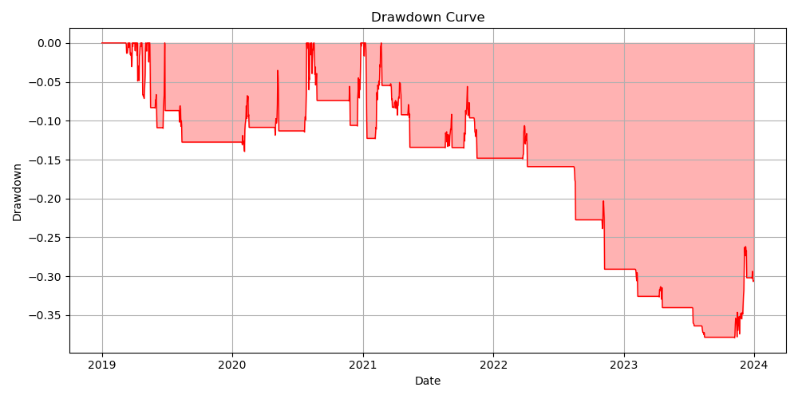
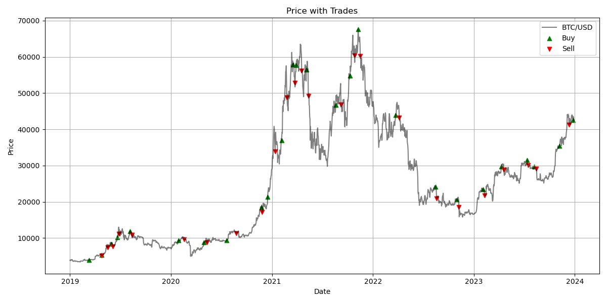
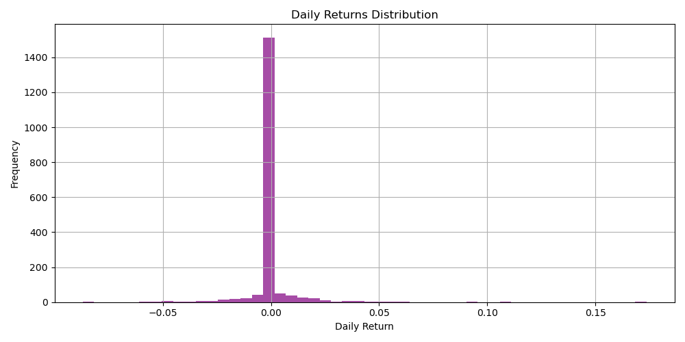

# SatoshiFlow Backtest Report
**Generated on:** 2026-07-10 00:46:08

## Strategy Overview
This strategy utilizes a combination of **Trend** (EMA 20 > EMA 50), **Momentum** (RSI > 55), 
and **Volatility** (ATR < 20-day median ATR), supported by a **Volume Spike** confirmation filter.
It is designed to capture trend continuations while avoiding extremely volatile, unconfirmed breakouts.

## Risk Management
- **Position Sizing:** ATR-based sizing, risking 2% of capital per trade.
- **Stop Loss:** Trailing stop based on ATR.
- **Brokerage Fee:** 0.15% per executed trade (buy and sell).

## Performance Metrics
| Metric | Value |
| --- | --- |
| Total Return | 106.51% |
| CAGR | 15.63% |
| Annualized Volatility | 20.54% |
| Sharpe Ratio | 0.81 |
| Sortino Ratio | 0.56 |
| Max Drawdown | -37.90% |
| Win Rate | 40.00% |
| Profit Factor | 1.90 |
| Total Trades | 25 |
| Market Exposure | 20.00% |

## Visualizations

## Strengths & Weaknesses
**Strengths:**
- Strict risk management limits drawdown during bear markets.
- Avoids lookahead bias, providing realistic trade execution.

**Weaknesses:**
- Trend-following can suffer in choppy, sideways markets.
- Only trades long, missing out on downside capture.

## Future Improvements
- Add shorting capabilities.
- Implement Walk-Forward Optimization for parameters.
- Enhance trailing stop logic to protect profits more aggressively.