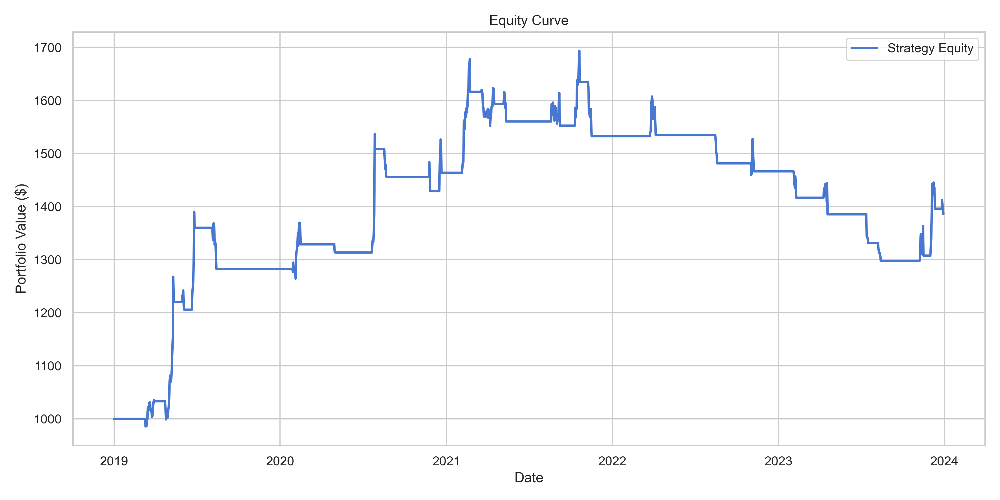
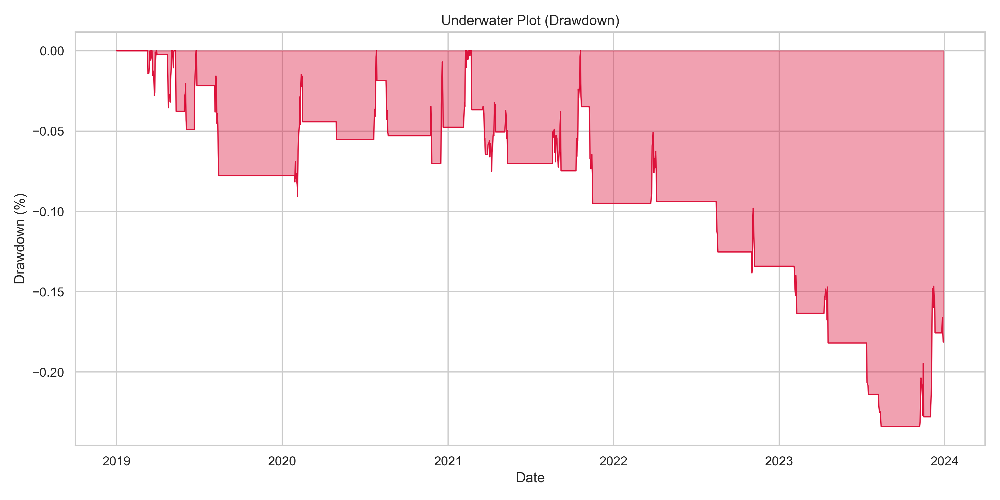
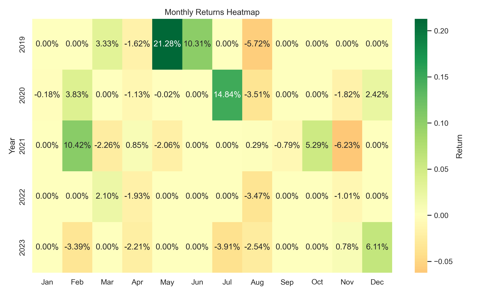
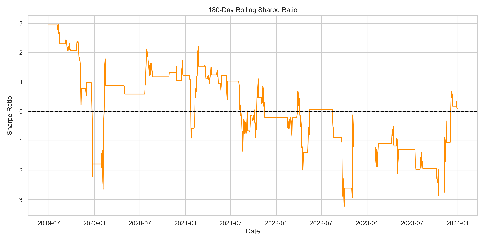

# SatoshiFlow V2 Quantitative Research Report
**Generated:** 2026-07-10 02:12:21

## 1. Abstract
This report details the backtest results and robustness checks of a systematic trend-following strategy applied to BTC/USD. The strategy aims to capture multi-week momentum while severely restricting volatility drag via ATR-based position sizing and trailing stops.

## 2. Research Motivation & Hypothesis
Cryptocurrency markets exhibit heavy-tailed return distributions and persistent volatility clustering. The hypothesis is that a volatility-normalized trend-following system can outperform a Buy & Hold approach on a risk-adjusted basis (higher Sharpe, lower Max Drawdown).

## 3. Methodology & Indicator Design
- **Trend Filter:** Fast EMA (20) > Slow EMA (50)
- **Momentum:** 14-day RSI > 55
- **Volatility Regime:** Current ATR(14) < 20-day median ATR
- **Volume Confirmation:** Volume > 20-day SMA

## 4. Bias Prevention & Execution Model
To prevent **lookahead bias**, signals generated at the close of time $t$ are executed at the `Open` price of time $t+1$. A slippage rate of 0.05% and brokerage of 0.15% are applied to every transaction.

## 5. Performance Metrics
| Metric | Value |
| --- | --- |
| Total Return | 38.73% |
| CAGR | 6.78% |
| Annualized Volatility | 13.02% |
| Sharpe Ratio | 0.57 |
| Sortino Ratio | 0.27 |
| Calmar Ratio | 0.29 |
| Max Drawdown | -23.39% |
| Ulcer Index | 0.1081 |
| Return Skewness | 4.66 |
| Return Kurtosis | 72.66 |
| Win Rate | 37.14% |
| Profit Factor | 1.58 |
| Expectancy | 1131.42% |
| Recovery Factor | 1.66 |
| Market Exposure | 12.27% |

## 6. Visualizations

## 7. Limitations & Future Directions
The model trades strictly long, meaning it suffers from zero returns (though protected from drawdowns) during prolonged bear markets. Future research should evaluate adding short exposure and optimizing parameters using Walk-Forward methodologies.